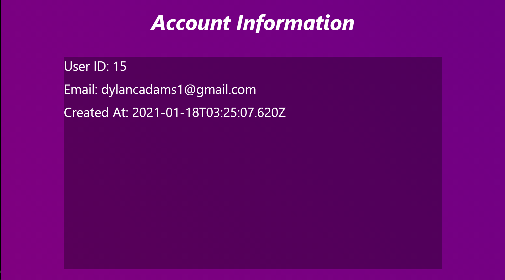

# React-Auth

## A React website with Next.JS

## Authentication is done through Next.JS which communicates with a local MySQL database.

## Login

## Create an Account

## Account Information
### Once I finish the authentication and signin process, this will be redesigned.

