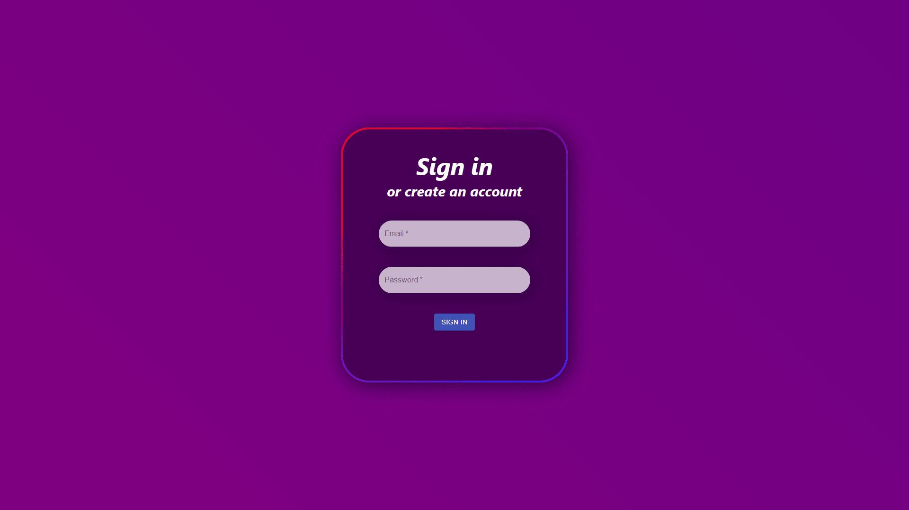
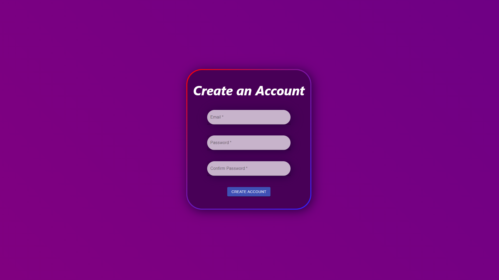
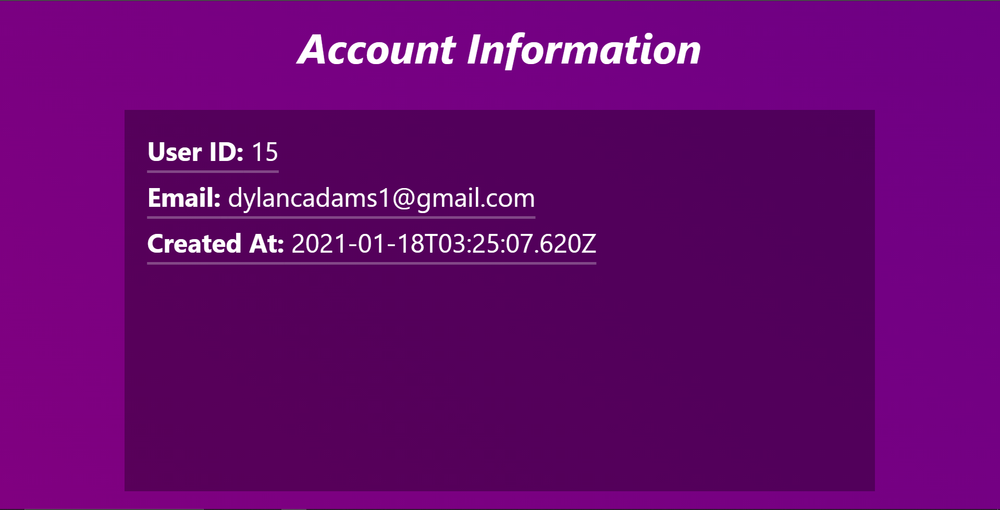
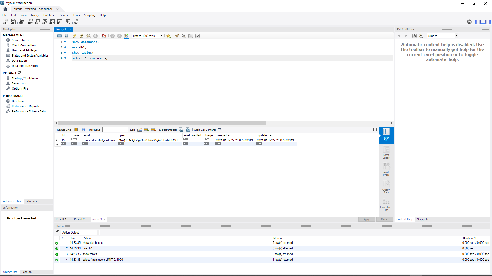

# React-Auth

## A React website with Next.JS

## Authentication is done through Next.JS which communicates with a local MySQL database.
## Password encryption is done with [bcrypt](https://www.npmjs.com/package/bcrypt)

## Login

## Create an Account

## Account Information
### This pulls data from the MySQL database if authentication succeeds. 
### Once I finish the authentication and signin process, this will be redesigned.

## Database in MySQL
### When a user signs up, a row is created in the users table.

